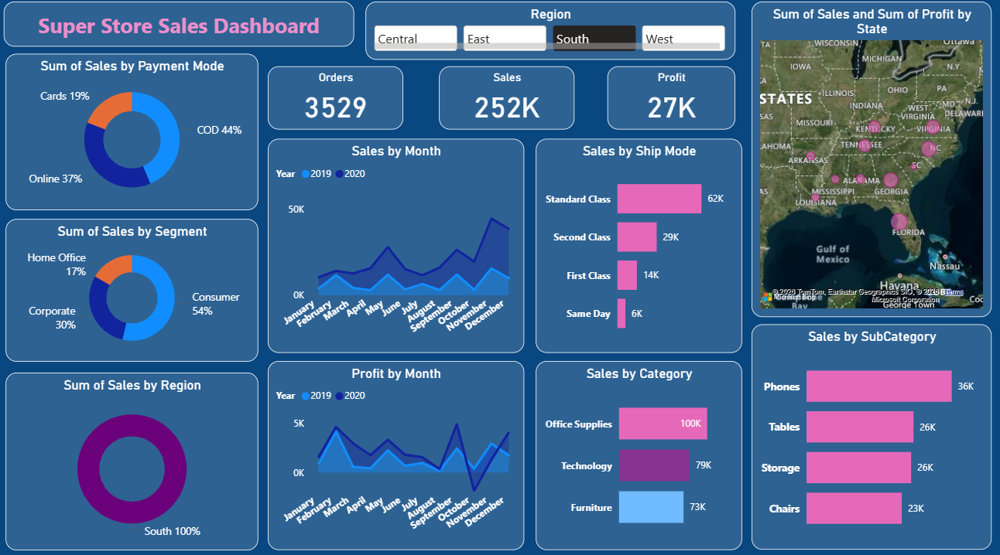

# 📊 Superstore Sales Dashboard (Power BI)

## 🔍 Project Overview
This dashboard analyzes Superstore sales data to track performance across:
- Sales
- Profit
- Orders
- Regions
- Categories
- Ship Modes

## 📌 KPIs
- Total Orders
- Total Sales
- Total Profit

## 📈 Visuals Included
- Sales by Month (2019 vs 2020)
- Profit by Month
- Sales by Category & Sub-Category
- Sales by Region (Map)
- Sales by Payment Mode
- Sales by Segment
- Sales by Ship Mode

## 🛠 Tools Used
- Power BI
- Excel / CSV Dataset
- Data Cleaning & DAX

## 🖼 Dashboard Preview

## 📂 Dataset
Superstore Sales Dataset (Kaggle)

## 👤 Created By
Vrushali Sathe